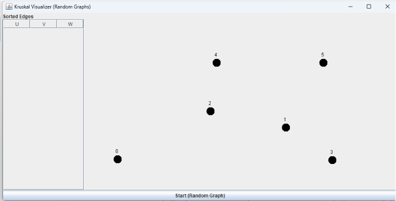
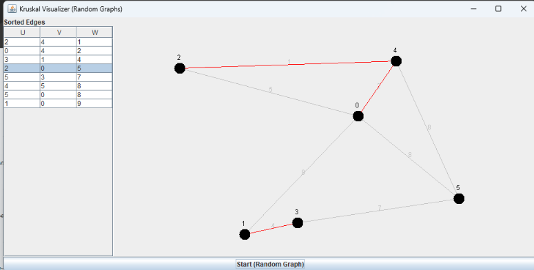
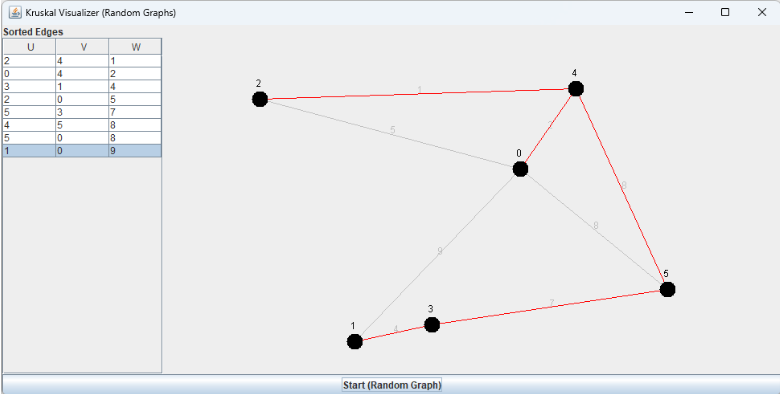
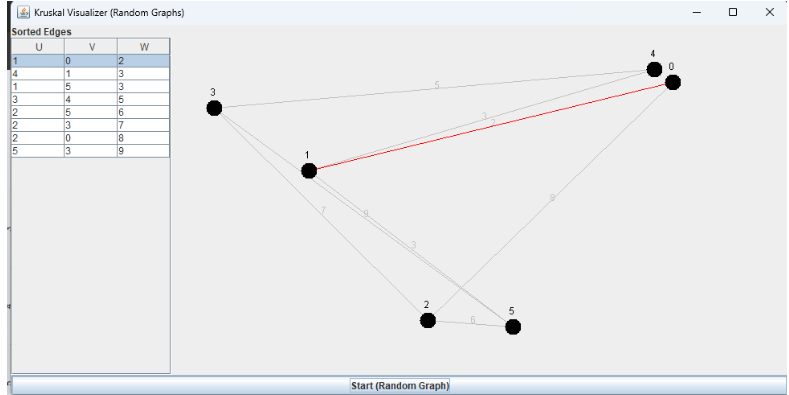
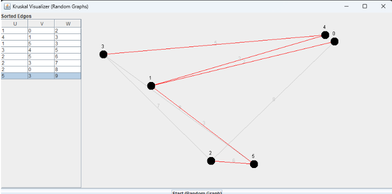

# 🌐 Kruskal Visualizer (Java Swing)


A visually interactive **Java Swing application** that demonstrates **Kruskal’s Algorithm** by constructing a **Minimum Spanning Tree (MST)** step by step on a randomly generated graph.

---

## ✨ Features

* 🎲 Random graph generation on each run
* 📊 Edge list displayed in sorted order
* 🎬 Step-by-step animation of algorithm execution
* 🔴 MST edges highlighted in real time
* 📍 Randomized node placement
* 🖥️ Clean and beginner-friendly UI

---

## 🧠 How Kruskal’s Algorithm Works

Kruskal’s Algorithm is a **greedy algorithm** used to find the Minimum Spanning Tree of a graph.

### Steps:

1. Sort all edges by weight
2. Select the smallest edge
3. Check for cycle using **Union-Find**
4. If no cycle → include edge in MST
5. Repeat until MST is complete

---

## 🖼️ Visualization Guide

| Element       | Meaning            |
| ------------- | ------------------ |
| ⚫ Black Nodes | Graph vertices     |
| ⚪ Gray Edges  | All edges          |
| 🔴 Red Edges  | Selected MST edges |

---

## 🚀 Getting Started

### 🔧 Prerequisites

* Java JDK 8 or higher

### ▶️ Run Locally

```bash
# Compile
javac KruskalVisualizer.java

# Run
java KruskalVisualizer
```

---

## 🎮 Usage

1. Click **"Start (Random Graph)"**
2. Watch the algorithm:

   * Table highlights current edge
   * Edges are evaluated in order
   * MST builds progressively (in red)
3. Animation stops automatically

---

## 📁 Project Structure

```
.
├── KruskalVisualizer.java
└── README.md
```

---

## 🔍 Core Components

* **Edge Class** → Represents graph edges
* **Union-Find (Disjoint Set)** → Detects cycles efficiently
* **GraphPanel** → Handles rendering
* **JTable** → Displays sorted edges
* **Swing Timer** → Controls animation

---

## ⚙️ Customization

You can tweak the behavior easily:

### Number of vertices

```java
int V = 6;
```

### Number of edges

```java
int edgeCount = 8;
```

### Animation speed (milliseconds)

```java
timer = new javax.swing.Timer(800, e -> processStep());
```

---

## ⚠️ Limitations

* Fixed graph size (unless modified in code)
* No manual graph input
* Random layouts may overlap visually

---

## 🚧 Future Improvements

* ✍️ Manual graph input
* ⏯️ Pause/Resume controls
* 📐 Better graph layout algorithms
* ➕ Display total MST weight
* 🔄 Step-back functionality

---

## 📸 Demo
> 
> 
> 
> 
> 

---

## 📜 License

This project is open-source and available for educational use.

---

## 👨‍💻 Author

Developed as a learning project to visualize graph algorithms using Java Swing.

