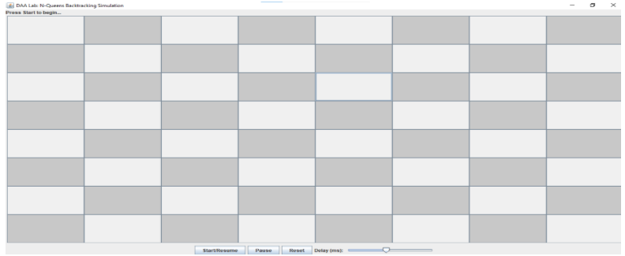
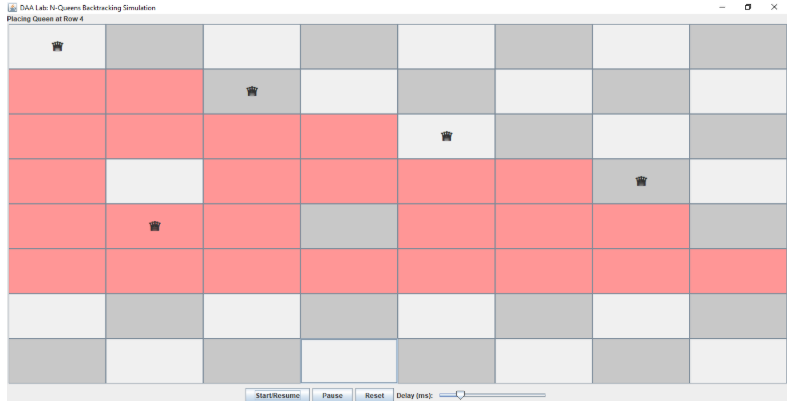
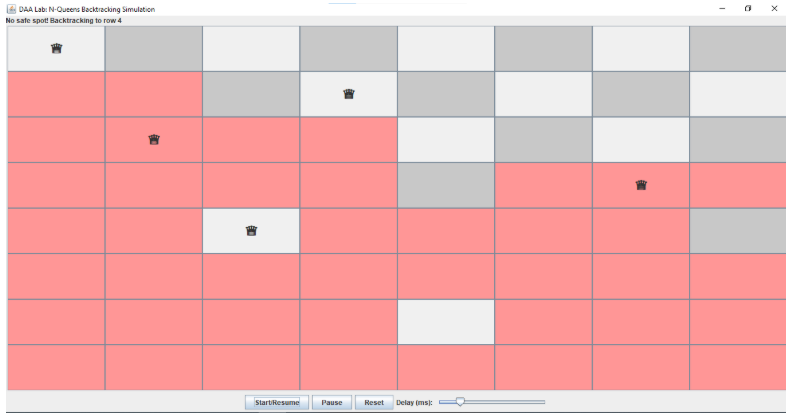
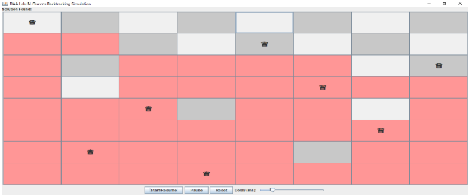

# ♟️ N-Queens Visualizer (Java Swing)


An interactive **Java Swing application** that visually demonstrates the **N-Queens Problem** using a **step-by-step backtracking algorithm**.

---

## ✨ Features

* ♟️ Real-time placement of queens on the board
* 🔄 Step-by-step **backtracking visualization**
* 🎬 Smooth animation using Swing Timer
* 🎚️ Adjustable speed control (slider)
* ⏯️ Start / Pause / Reset controls
* 🚫 Visual feedback for conflicts (red highlights)
* 📢 Status updates during execution

---

## 🧠 Problem Overview

The **N-Queens Problem** asks:

> How can you place **N queens on an N×N chessboard** so that no two queens attack each other?

### Constraints:

* No two queens share the same **row**
* No two queens share the same **column**
* No two queens share the same **diagonal**

---

## ⚙️ Algorithm Used: Backtracking

This visualizer uses a **backtracking approach**, where:

1. Place a queen row by row
2. Check if the position is safe
3. If safe → move to next row
4. If not → try next column
5. If no valid column → **backtrack** to previous row

---

## 🖼️ Visualization Guide

| Element            | Meaning                 |
| ------------------ | ----------------------- |
| ⬜ Light/Dark Cells | Chessboard tiles        |
| ♛ Queen Symbol     | Placed queen            |
| 🔴 Red Cell        | Conflict (invalid move) |
| 📢 Status Bar      | Current algorithm step  |

---

## 🚀 Getting Started

### 🔧 Prerequisites

* Java JDK 8 or higher

### ▶️ Run Locally

```bash id="run1"
# Compile
javac NQueensVisualizer.java

# Run
java NQueensVisualizer
```

---

## 🎮 Controls

| Button           | Function                       |
| ---------------- | ------------------------------ |
| ▶️ Start/Resume  | Begins or continues simulation |
| ⏸️ Pause         | Stops animation                |
| 🔄 Reset         | Clears board and restarts      |
| 🎚️ Speed Slider | Adjusts animation delay        |

---

## 📁 Project Structure

```id="struct1"
.
├── NQueensVisualizer.java
└── README.md
```

---

## 🔍 Core Components

* **Grid (JButtons)** → Represents chessboard
* **Backtracking Logic** → Solves N-Queens step-by-step
* **Timer (Swing)** → Controls animation speed
* **Status Label** → Displays current operation

---

## ⚙️ Customization

### Change board size

```java id="cust1"
private final int N = 8;
```

### Adjust speed range

```java id="cust2"
JSlider speedSlider = new JSlider(100, 1000, 500);
```

---

## ⚠️ Limitations

* Default board size is fixed (8×8)
* Only one solution is shown
* Visualization focuses on clarity over performance

---

## 🚧 Future Improvements

* 🔢 Support for dynamic board sizes (N input)
* 🧮 Show total number of solutions
* ⏩ Step-forward / step-back controls
* 🎨 Improved UI styling (themes)
* 📊 Performance metrics display

---

## 📸 Demo

> 
> 
> 
> 

---

## 📜 License

This project is open-source and available for educational purposes.

---

## 👨‍💻 Author

Developed as part of a **Design and Analysis of Algorithms (DAA)** lab to visualize backtracking concepts.

